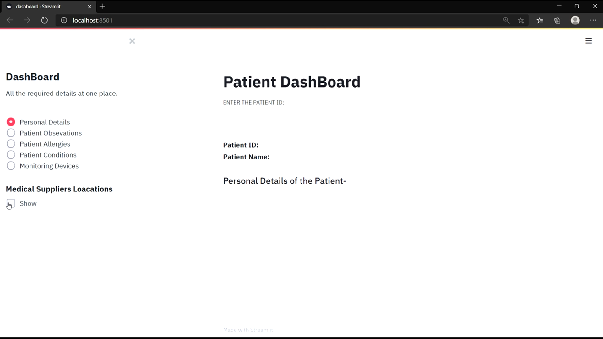
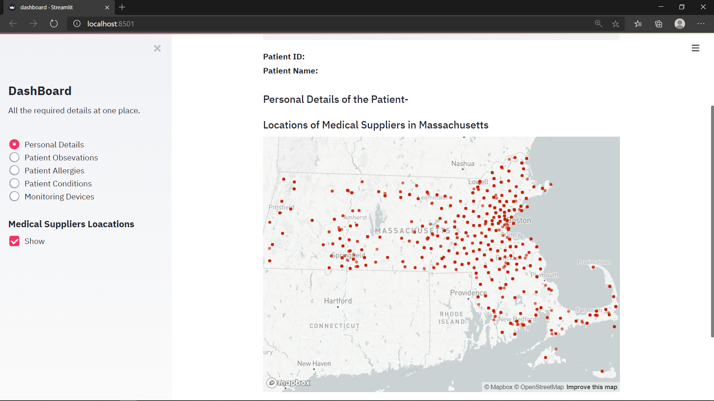
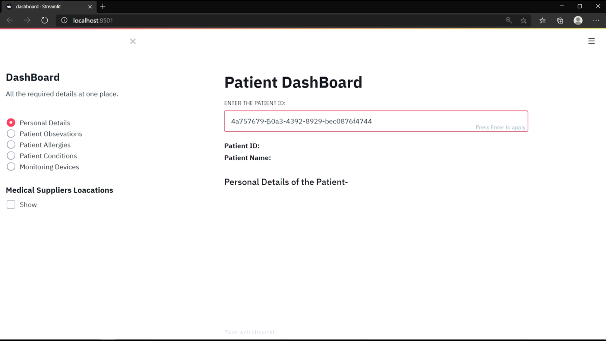
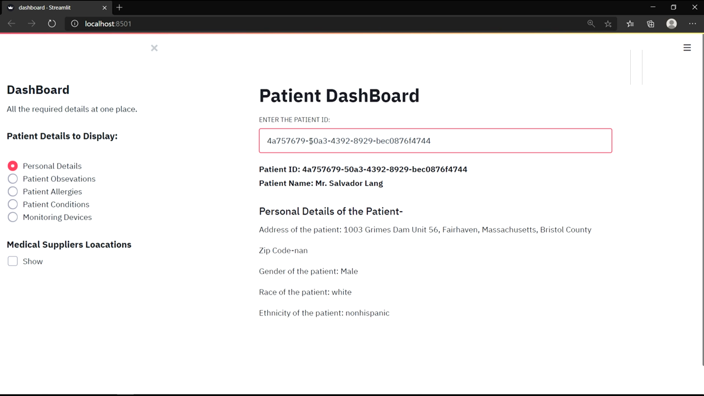
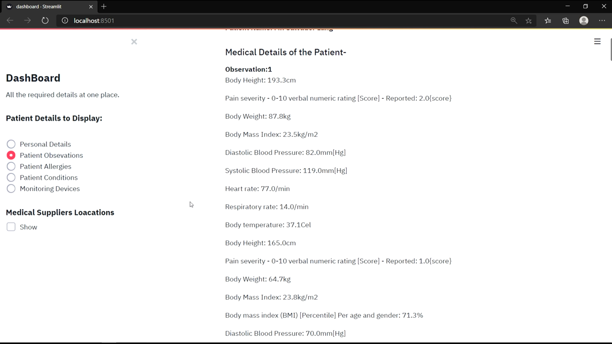
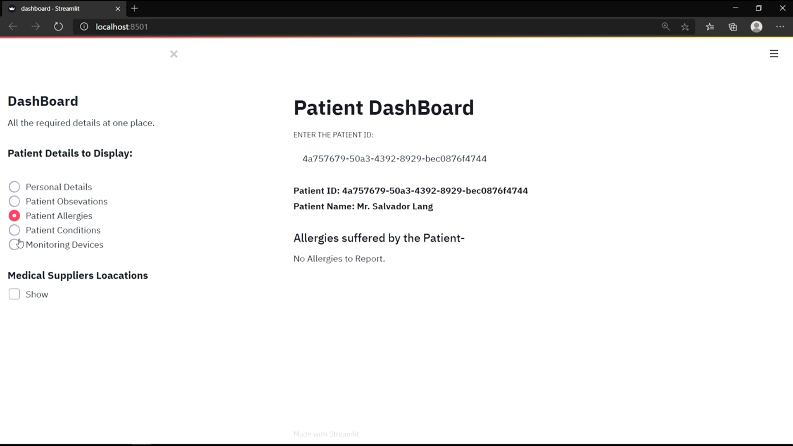
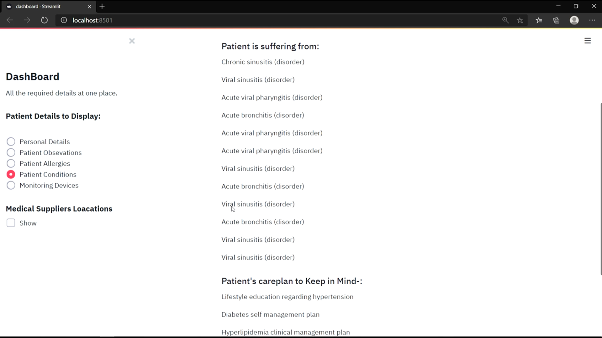

# Dashboard-Patient-Details
An interactive dashboard using Python(Streamlit, numpy , pandas) to easily collect and show all the details of a aptient saved across various datasets in one place. 
This can help the patients and their caretakers to easily acces the data regarding patient ad take better care of them. 
 
Some Patient id's for testing-: 
76982e06-f8b8-4509-9ca3-65a99c8650fe 
ad2e9916-4979-40fc-a8c0-68651a0cb5a6 
518f83f3-a717-4705-a181-06e205df480b 
(for more see the csv files)
  
Some Scshots are shown below-

  

  

  

  

  

  

